# Guidance for Full Duplex Open Platform Communication on AWS

---

## Table of Content

List the top-level sections of the README template, along with a hyperlink to the specific section.

1. [Overview](#overview)
    - [Cost](#cost)
2. [Prerequisites](#prerequisites)
    - [Operating System](#operating-system)
3. [Deployment Steps](#deployment-steps)
4. [Deployment Validation](#deployment-validation)
5. [Running the Guidance](#running-the-guidance)
6. [Next Steps](#next-steps)
7. [Cleanup](#clean-up)
8. [Notices](#notices)

## Overview

This sample shows how to use [AWS Greengrass V2 custom components](https://docs.aws.amazon.com/greengrass/v2/developerguide/develop-greengrass-components.html) to connect to an [OPCUA/DA](https://www.opc7.com/opc-ua-vs-da/) server & bi-directionally sync industrial IOT data between AWS cloud and edge using [AWS IOT Core](https://docs.aws.amazon.com/iot/latest/developerguide/what-is-aws-iot.html).

OPC UA (Unified Architecture) and OPC DA (Data Access) are industrial automation and control system communication protocols. They are both members of the [OPC (Open Platform Communications)](https://opcfoundation.org/) family of protocols, but their functionality and use cases differ significantly.

The custom AWS Greengrass V2 components provide guidance to read, write OPCUA nodes and OPCDA tags. Additionally, they show subscribing to data changes for OPCUA nodes. We then use [AWS IoT Core named shadow service](https://docs.aws.amazon.com/iot/latest/developerguide/iot-device-shadows.html) to sync OPC UA/DA server data to cloud & set desired control data in the shadows, which then gets written to the respective OPC server; thus enabling a full duplex data exchange between cloud & edge via [MQTT](https://mqtt.org/).

This guidance can also be extended to open up opportunities for protocol unification, conversions, modifications & transfer OPC data over MQTT. Users may use any number of additional custom AWS Greengrass V2 components to integrate other industrial communication protocols such as [modbus](https://openautomationsoftware.com/blog/what-is-modbus/), MQTT, serial etc. and sync to the cloud.

### Cost

You are responsible for the cost of the AWS services used while running this Guidance. As of January 2024, the cost for running this Guidance with the default settings in the Oregon (us-west-2) is approximately $69 per month. The main cost driver is the EC2 instance that acts as an AWS IoT GreenGrass Core device. We use a T3 Large instance to run Windows 2022 Server edition, that needs a minimum of 8GB of RAM for optimal performance. The cost can be further brought down by following the [Next Steps](#next-steps) guide.

---

## Architecture

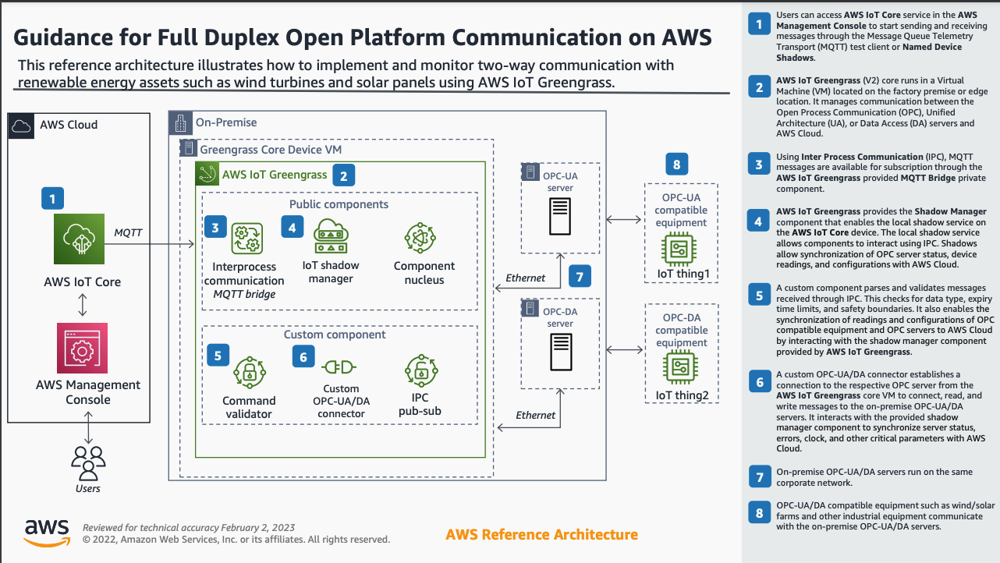

For this sample, we will be creating an EC2 instance to act as OPCUA/DA servers & also as an [AWS IoT Greengrass Core device](https://docs.aws.amazon.com/greengrass/v2/developerguide/setting-up.html). Actual production implementation will vary as there will be dedicated OPC servers & an internet/zone gateway device that integrates the edge with AWS Cloud.

The published solution guidance can be found here - <https://aws.amazon.com/solutions/guidance/full-duplex-open-platform-communication-on-aws/>

---

## Prerequisites

### Operating System

Lets setup the dev machine. Please note that this guide was tested on a MacBook 💻 but we try to provide instructions for Windows as well.

### Node JS setup

We will be using [AWS Cloud Development Kit (AWS CDK)](https://aws.amazon.com/cdk/) to provision AWS Cloud resources. The AWS CDK lets you build reliable, scalable, cost-effective applications in the cloud with the considerable expressive power of a programming language. The AWS Cloud Development Kit (AWS CDK) lets you define your cloud infrastructure as code in one of its supported programming languages. It is intended for moderately to highly experienced AWS users.

We use TypeScript for AWS CDk 7 hence must install Node JS in our dev machine as the first step. We recommend installing Node JS version 18.19.0 (x64 bit). Which can be obtained here <https://nodejs.org/download/release/v18.19.0/>

### Java Setup

We require Java to be setup as we will be developing some Java based AWS Greengrass custom components. We recommend installing Amazon Corretto, a no-cost, multi-platform, production-ready distribution of OpenJDK.

Corretto comes with long-term support that will include performance enhancements and security fixes. Amazon runs Corretto internally on thousands of production services and Corretto is certified as compatible with the Java SE standard. With Corretto, you can develop and run Java applications on popular operating systems, including Linux, Windows, and macOS.

We recommend version 17 which can be obtained from here <https://docs.aws.amazon.com/corretto/latest/corretto-17-ug/downloads-list.html>

### Maven Setup

We would also need [maven](https://maven.apache.org/what-is-maven.html) to build & generate JAR files for AWS Greengrass custom components.

For Mac  💻 we recommend using [HomeBrew](https://formulae.brew.sh/formula/maven) on Mac to setup Maven.

For Windows please follow this guide - <https://www.tutorialspoint.com/maven/maven_environment_setup.htm>

### Python setup

We require Python to be setup as we will be developing some Python based AWS Greengrass custom components.

Python can be installed from here - <https://www.python.org/downloads/>.

### AWS CLI

The AWS Command Line Interface (AWS CLI) is an open source tool that enables you to interact with AWS services using commands in your command-line shell. With minimal configuration, the AWS CLI enables you to start running commands that implement functionality equivalent to that provided by the browser-based AWS Management Console from the command prompt in your terminal program.

AWS CLI can be installed from here - <https://docs.aws.amazon.com/cli/latest/userguide/getting-started-install.html>

---

## Deployment Steps

Let's now setup the repo on the local dev machine to deploy the AWS CDK infra assets and AWS Greengrass Components to a desired AWS Account.

### Install Node Dependencies

This will install all Node JS dependencies in your dev machine. From the project repo root directory

```unix
cd infra
npm install 
```

### AWS Account Credentials

With AWS CLI, we can now setup AWS Account credentials on your dev machine. Follow [this guide](https://docs.aws.amazon.com/cli/latest/userguide/cli-chap-configure.html) to setup AWS Account credentials.

### SSM Key Value Pair

In the next steps we will be creating an EC2 instance to act as our Greengrass Core device which needs an EC2 key pair to establish RDP connectivity to the Ec2 instance. We use AWS Management Console to RDP into the EC2 instance using [AWS Fleet Manager](https://docs.aws.amazon.com/systems-manager/latest/userguide/fleet.html). Follow the instructions below to create the key value pair.

- Access the management console of your AWS account & search for EC2 service or click [this link](https://us-west-2.console.aws.amazon.com/ec2/home?region=us-west-2#CreateKeyPair:) to access the key pair creation page directly
- in the EC2 service page, expand the menu icon on the left side of the scree and click on `Key Pairs` under `Network & Security` section
- Click on `Create key pair` button
- ensure the key pair name is `node-red-windows`. **YOU MUST** set the key value pair name as `node-red-windows`. This name is hardcoded in our CDK stack to allow access to the EC2 instance via RDP from management console.
- retain all the default options & click `create key pair` button
- download the key value pair & store it safe in your dev machine as we will be using this later to RDP to our Windows EC2 instance.

### CDK Bootstrap

Bootstrapping is the process of provisioning resources for the AWS CDK before you can deploy AWS CDK apps into an AWS environment. (An AWS environment is a combination of an AWS account and Region).

These resources include an Amazon S3 bucket for storing files and IAM roles that grant permissions needed to perform deployments.

The required resources are defined in an AWS CloudFormation stack, called the bootstrap stack, which is usually named CDKToolkit. Like any AWS CloudFormation stack, it appears in the AWS CloudFormation console once it has been deployed.

If you are using AWS cloud9 as an IDE, please follow these [instructions](https://docs.aws.amazon.com/cloud9/latest/user-guide/sample-cdk.html).

> we have setup us-west-2 as our default region for greengrass components which can be changed to any region of choice

```unix
cd infra
cdk bootstrap aws://ACCOUNT-NUMBER-1/REGION-1 
```

### CDK Deploy

This will setup the following AWS Cloud resources in the target AWS Account for which you had configured the credentials in the [previous step](#aws-account-credentials).

- A 64 bit sWindows 2022 Server edition EC2 instance with SSM access
- An IAM role to assume to configure the EC2 instance as an AWS Greengrass core device.
- An AWS S3 bucket to publish custom AWS Greengrass Components
- Set of AWS IAM roles, IoT roles, security certificate policies to enable connectivity between the EC2 instance & AWS Cloud.

Execute the following command from `infra` folder path and type 'Y' when prompted to setup AWS Cloud resources -

> you may use AWS CloudFormation service page to track the deployment progress in the target AWS Account.

```unix
cd infra
cdk deploy --all
```

Once the deployment succeeds, note down the outputs generated, we will be needing the resource names & ARNs later.

```txt
 ✅  NodeRedGreengrass

✨  Deployment time: 96.53s

Outputs:
NodeRedGreengrass.ExportsOutputFnGetAttTemporaryCredentialsRoleFXXXXXXXXX = arn:aws:iam::XXXXXXXXX:role/NodeRedGreengrass-TemporaryCredentialsRoleFXXXXXXXXX
NodeRedGreengrass.TemporaryCredentialsAssumeRole = arn:aws:iam::XXXXXXXXX:role/NodeRedGreengrass-TemporaryCredentialsRoleFXXXXXXXXX
NodeRedGreengrass.ThingPolicy = GreengrassIoTPolicy_XXXXXXXXX
NodeRedGreengrass.TokenExchangeRole = NodeRedTokenExchangeRole
NodeRedGreengrass.TokenExchangeRoleAlias = GreengrassV2TokenExchangeRoleAlias_XXXXXXXXX
```

### Accessing EC2 Instance

To access the EC2 instance head to the EC2 service page from AWS Management console and select `Connect` to the instance named `NodeRedSimulator/WindowsInstance`.

Select `RDP Client` tab & choose `Connect using Fleet Manager` option under `Connection Type` then click on `Fleet Manager Remote Desktop` button.

A new browser tab will open up. Select `Key pair` option and browse for the Key Pair file we created earlier in the [SSM Key Value Pair step](#ssm-key-value-pair) & hit `connect`.

You will then see the desktop load up for the EC2 instance we created. Let's now setup the EC2 instance as our AWS Greengrass core device & to run OPCUA/DA servers.

---

## EC2 Instance Setup

The EC2 instance created will serve as the device that runs the AWS IoT Greengrass Core software. A Greengrass core device is an AWS IoT thing. You can add multiple core devices to AWS IoT thing groups to create and manage groups of Greengrass core devices all mapped to your AWS account.

The AWS IoT Greengrass Core software includes an installer that sets up your EC2 instance or any device (ex. a Raspberry Pi) as a Greengrass core device. When you run the installer, you can configure options, such as the root folder and the AWS Region to use. You can choose to have the installer create required AWS IoT and IAM resources for you. You can also choose to deploy local development tools to configure a device that you use for custom component development. We will get to this part in a bit. But first, let's now get some basic software setup in our AWS EC2 instance.

The same EC2 instance will also be configured as the OPCUA & OPCDA servers as well. A typical production system will have dedicated machines as a Greengrass core device & OPCUA/da servers connected to the same network. However, we try & keep things simple for this sample repo. We will use [Node-Red](https://nodered.org/) to emulate as our OPCUA server & [Matrikon Explorer Windows application](https://www.matrikonopc.com/downloads/178/productsoftware/index.aspx) to emulate OPCDA server.

### EC2 AWS CLI Setup

Lets install the AWS CLI the same way as we did for our dev machine from [the steps above](#aws-cli)

<https://awscli.amazonaws.com/AWSCLIV2.msi>

### Java Installation

We require Amazon Corretto OpenJDK 11 to configure the EC2 instance as a AWS Greengrass Core device. Follow Follow the link here & install Java OpenJDK version 11.

<https://corretto.aws/downloads/latest/amazon-corretto-11-x64-windows-jdk.msi>

---

## Setup Greengrass Core Device

Let us now configure the Ec2 instance as the Greengrass Core Device.

### Create GGC user

The first step involves creating a dedicated user in the Ec2 instance which we will name as `ggc_user`. This `ggc_user` will be used by the Greengrass Core service to establish trust with the AWS Cloud,  negotiate session credentials, establish MQTT & HTTPS connection with the AWS Account endpoint. we have completed the AWS cloud side setup by setting up AWS IoT thing policy, IAM roles & other necessary configurations while deployed the CDK stacks in the previous steps.

- To Create a windows use enter the following commands in the cmd terminal in the EC2 instance.

```cmd
# replace the password with a unique password & write the password down in a safe location
net user /add ggc_user password

# disable password expiry 
wmic UserAccount where "Name='ggc_user'" set PasswordExpires=False

#If you’re using Windows 10 or later where the wmic command is deprecated, run the following #PowerShell command

Get-CimInstance -Query "SELECT * from Win32_UserAccount WHERE name = 'ggc_user'" | Set-CimInstance -Property @{PasswordExpires="False"}

```

Now let's save the password for the `ggc_user` in the [PsExec utility](https://docs.microsoft.com/en-us/sysinternals/downloads/psexec) so the AWS Greengrass service can assume the user `ggc_user` we created to connect to AWS Cloud.

- Download and install the [PsExec utility](https://docs.microsoft.com/en-us/sysinternals/downloads/psexec) from Microsoft on the device. Download & extract
- open the CMD terminal in the path where the `PSTools` folder was extracted and type the following command

```cmd
# replace password with the password you had written down 
psexec -s cmd /c cmdkey /generic:ggc_user /user:ggc_user /pass:password

# success response 
CMDKEY: Credential added successfully.
cmd exited on EC2XXX-XXXXX with error code 0.`
```

- If the PsExec License Agreement opens, choose Accept to agree to the license and run the command.

### Get Credentials

From the EC2 management console search for the EC2 instance named `NodeRedSimulator/WindowsInstance` and select `connect` and choose `Session Manager` tab and hit `connect` button. This will open a command line

From sessions manager command line enter the following command to assume an IAM role that was created upon the CDK deployment.This role is a privileged role to get AWS session credentials to set up the EC2 instance as a AWS Greengrass core device.

```bash
# the role-arn can be found in the CDK deployment outputs NodeRedGreengrass.TemporaryCredentialsAssumeRole
aws sts assume-role --role-arn arn:aws:iam::XXXXXXXXX:role/NodeRedGreengrass-TemporaryCredentialsRoleXXXXX-XXXXX --role-session-name gg-temp-cred > C:\creds.txt

```

This will have created a file under `C:\creds.txt` and can be accessed via the RDP UI via AWS Fleet Manager.

Let's configure the AWS Credentials via the AWS CLI. Open a new CMD window and type the following command

> we used AWS region `us-west-2` as our default region in the samples

```cmd
aws configure

AWS Access Key ID [None]: XXXXXXXX
AWS Secret Access Key [None]: XXXXXXXX
Default region name [None]: YOUR_REGION
Default output format [None]: json

aws configure set aws_session_token <SESSION_TOKEN>
```

The file under `C:\creds.txt` will contain the `aws_access_key_id`, `aws_secret_access_key` & the `aws_session_token` that needs to be used in the step above.

Verify if you have configured the AWS credentials correctly by opening a new CMD window and enter the following command.

The response must contain the correct AWS Account & the Temporary Credentials role titled `NodeRedGreengrass-TemporaryCredentialsRole`.

```cmd
aws sts get-caller-identity

# response must be 
{
    "UserId": "XXXXXXXXXXXXXXX:gg-temp-cred",
    "Account": "XXXXXXXXXXXXXXX",
    "Arn": "arn:aws:sts::XXXXXXXXXXXXXXX:assumed-role/NodeRedGreengrass-TemporaryCredentialsRoleXXXXXXX-XXXXXXXX/gg-temp-cred"
}
```

### Run the Greengrass Installer

To setup the EC2 instance as a greengrass core device, AWS IoT service team has created a installer. The entire set-up instructions are [here](https://docs.aws.amazon.com/greengrass/v2/developerguide/quick-installation.html) -

Let's start by downloading the latest installer from <https://docs.aws.amazon.com/greengrass/v2/developerguide/quick-installation.html>

Verify if the downloader is authentic by running this command in a CMD window from the path where the `zip` file is downloaded

```cmd
cd C:\Users\Administrator\Downloads
https://d2s8p88vqu9w66.cloudfront.net/releases/greengrass-nucleus-latest.zip

# response 
...
...
...
jar verified.

The signer certificate will expire on 2024-03-27.
The timestamp will expire on 2031-11-09.

```

- unzip the `zip` file under `C:\GreengrassInstaller` and run the following command

Follow a detailed instructions on the installation here - <https://docs.aws.amazon.com/greengrass/v2/developerguide/quick-installation.html#run-greengrass-core-v2-installer>

Note that we already have all the roles, alias and default user created during CDK deploy phase. Please ensure to make the appropriate updates to the commands below where -

- region -> `us-west-2` ; you can change it to a region of choice
- MyGreengrassCore -> NodeRedCore  ; you can change it to a value of choice
- MyGreengrassCoreGroup -> OPCGroup  ; you can change it to a value of choice
- GreengrassV2IoTThingPolicy - GreengrassIoTPolicy_XXXXX from the CDK output text
- GreengrassV2TokenExchangeRole - NodeRedTokenExchangeRole
- GreengrassCoreTokenExchangeRoleAlias - GreengrassV2TokenExchangeRoleAlias_XXXX  from the CDK output text

```cmd
java -Droot="C:\greengrass\v2" "-Dlog.store=FILE" ^
  -jar ./GreengrassInstaller/lib/Greengrass.jar ^
  --aws-region region ^
  --thing-name MyGreengrassCore ^
  --thing-group-name MyGreengrassCoreGroup ^
  --thing-policy-name GreengrassV2IoTThingPolicy ^
  --tes-role-name GreengrassV2TokenExchangeRole ^
  --tes-role-alias-name GreengrassCoreTokenExchangeRoleAlias ^
  --component-default-user ggc_user ^
  --provision true ^
  --setup-system-service true
```

The response will have

```cmd
...
...
...

Attaching IAM role policy for TES to IAM role for TES...
Configuring Nucleus with provisioned resource details...
Downloading Root CA from "https://www.amazontrust.com/repository/AmazonRootCA1.pem"
Created device configuration
Successfully configured Nucleus with provisioned resource details!
Successfully set up Nucleus as a system service

```

You may now head to the AWs IoT Core service page in your AWS Account's management account & see an IoT Thing named `NodeRedCore`. The same device can be also found under `Greengrass devices` with status as `Healthy`.

### Create a Named Shadow

Now that we have created a AWS Greengrass core device we will now create a named shadow to send & receive OPCUA/DA nodes/tags data to & from AWS cloud to edge location. Learn more about using shadows [here](https://docs.aws.amazon.com/iot/latest/developerguide/device-shadow-comms-device.html).

In your AWS Account, head to AWS IoT Core -> All Devices -> Things -> NodeRedCore and select the `Device Shadows` tab & click on `Create Device Shadow`.

Select `named Shadow` and give shadow name as `opc`. The name **MUST** be `opc` as it has ben configured in the custom Greengrass components.

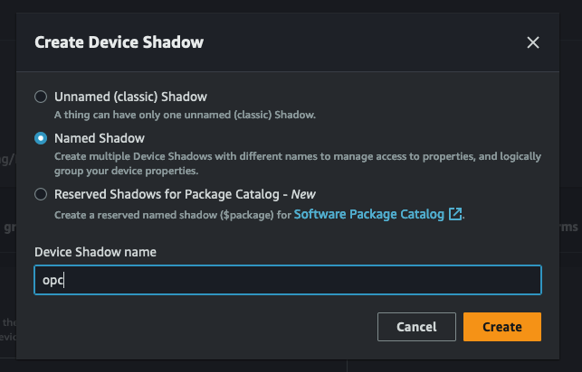

---

## OPCUA Server Setup

This setup instructions walks through the steps needed to setup, configure & run a OPCUA simulation server.

### Node-RED Installation

[Node-RED](https://nodered.org/) is a programming tool for wiring together hardware devices, APIs and online services in new and interesting ways.

It provides a browser-based editor that makes it easy to wire together flows using the wide range of nodes in the palette that can be deployed to its runtime in a single-click.
Lets start by installing Node JS on the EC2 instance. We will follow the same [Node JS installations](#node-js-setup)

<https://nodejs.org/download/release/v18.19.0/>

Once Node Js is installed, lets install Node-red & the [node-red-contrib-iiot-opcua library](https://flows.nodered.org/node/node-red-contrib-iiot-opcua).

```cmd
# install Node-red
npm install -g --unsafe-perm node-red

# install Node-red OPCUA IIOT Server 
npm install -g node-red-contrib-iiot-opcua
```

### Open SSL Installation

We require OpenSSL for windows for configuring the OPCUA server components via Node-red.

The Win32/Win64 OpenSSL Installation Project is dedicated to providing a simple installation of OpenSSL for Microsoft Windows. It is easy to set up and easy to use through the simple, effective installer.

<https://slproweb.com/download/Win64OpenSSL-3_2_0.msi>

### Import the OPCUA Server Configuration

The Node-Red flow for the OPCUA is included in [infra/components/node-red/opcua-node-red.json](infra/components/node-red/opcua-node-red.json). To start `Node_red` open a new CMD window and type the following command & keep the CMD terminal window running

```cmd
node-red
```

In a new browser tab enter `http://localhost:1880/`. This brings the Node_red console setup. Now download the [/infra/components/node-red/opcua-node-red.json](/infra/components/node-red/opcua-node-red.json) file to the EC2 instance and import the flow into Node-Red console from the hamburger icon on the right hand top corner.  

Once imported hit `Deploy` button on the top right corner. You ma check the debug log by pressing the debug (bug) icon or check the command terminal for all the log statements received from Node-red

> Sometimes the process may be stuck at deploying. Hit enter multiple times on the Node-Red command terminal process window to kick start deployment.

### OPCUA Server configurations

The OPCUA server is an example server & MUST NOT be used in any production environment. The OPCUA server configuration can be customized by double clicking the block titled `OPCUA Server`. The assumption is that the OPCUA server is managing a Wind Turbine farm and has nodes configured for one of those turbines named `TurbineStatus` which is a `boolean` that can be used to turn the turbine on/off. The second node is the `TurbineSpeed` which updates turbine speed in RPM.

You may toggle the `TurbineStatus` by pressing on the ear/handle of the blocks titled `Turbine Start` & `Turbine Stop` to update the `TurbineStatus` node.

The Speed Randomizer is on a 20 sec timer which will randomize the speed of the turbine. However, the Turbine must be in start position by making the `TurbineStatus` value to True/1. Once the Turbine is set to start state you can observe the speed setting is randomized.

You may double-click any block to view their configuration. Watch the [Node-Red fundamentals](https://www.youtube.com/watch?v=3AR432bguOY) to learn more.

Now that we have the OPCUA server running, lets deploy our first custom AWS Greengrass component to sync the OPCUA server node date viz. `TurbineStatus` & `TurbineStatus` to AWS Cloud.

---

## OPCUA Greengrass Java Component

Read more about the OPCUA component under [/infra/components/opcua/](/infra/components/opcua/)

AWS IoT Greengrass components are software modules that you deploy to Greengrass core devices. Components can represent applications, runtime installers, libraries, or any code that you would run on a device. You can define components that depend on other components. For example, you might define a component that installs Python, and then define that component as a dependency of your components that run Python applications. When you deploy your components to your fleets of devices, Greengrass deploys only the software modules that your devices require.

We used AWS provided [AWS IoT Greengrass Development Kit Command-Line Interface (GDK CLI)](https://docs.aws.amazon.com/greengrass/v2/developerguide/greengrass-development-kit-cli.html) to create a custom component that can run on any AWS greengrass core device. You can use the GDK CLI to create, build, and publish custom components. When you create a component repository with the GDK CLI, you can start from a template or a community component from the Greengrass Software Catalog. Then, you can choose a build system that packages files as ZIP archives, uses a Maven or Gradle build script, or runs a custom build command. After you create a component, you can use the GDK CLI to publish it to the AWS IoT Greengrass service, so you can use the AWS IoT Greengrass console or API to deploy the component to your Greengrass core devices.

Let's start by installing the GDK CLI tool by running this command in your Dev machine

> Please make sure to run this command in your DEV machine & NOT the EC2 instance

```unix
python3 -m pip install -U git+https://github.com/aws-greengrass/aws-greengrass-gdk-cli.git@v1.6.1

# verify installation 
gdk --help
```

The OPCUA Greengrass component is fully written & configured and located under [components folder /infra/components/opcua/](/infra/components/opcua/).  

### OPCUA Component Publication

To publish this component in our AWS Greengrass Core device, which in our case is the Windows EC2 instance, we need to build & publish this component to the target AWS account.

Let's verify the `gdk-config` [file in /infra/components/opcua/gdk-config.json](/infra/components/opcua/gdk-config.json) and make sure we have the right region selected. Note, this region must be same as the region where the CDK deployment was made & where the Greengrass Core device was registered. Now in a terminal window CD into the `/opcua` folder

```cmd
gdk component build
```

If Java & Maven has been correctly configured in the dev machine you will see the following output

```text
[INFO] ------------------------------------------------------------------------
[INFO] BUILD SUCCESS
[INFO] ------------------------------------------------------------------------
[INFO] Total time:  3.807 s
[INFO] Finished at: 2023-12-18T17:43:27-08:00
[INFO] ------------------------------------------------------------------------

```

The Next step is to publish this component to an AWS S3 bucket titled `greengrass-artifacts` in the target AWS Account. This bucket must have been already created while deploying the CDK stacks and no configuration further is necessary. In the same terminal window type the following command

```cmd
gdk component publish

# response 
...
...
...

[2023-12-18 17:47:11] INFO - Updating the component recipe com.example.Opcua-1.0.0.
[2023-12-18 17:47:11] INFO - Validating the file size of the built recipe  /opcua-da/code/full-duplex-opc-ua-da-unifier-for-industrial-iot/infra/components/opcua/greengrass-build/recipes/com.example.Opcua-1.0.0.yaml
[2023-12-18 17:47:11] INFO - Validating the built recipe against the Greengrass recipe schema.
[2023-12-18 17:47:11] INFO - Creating a new greengrass component com.example.Opcua-1.0.0.
[2023-12-18 17:47:12] INFO - Created private version '1.0.0' of the component 'com.example.Opcua' in the account.


```

Verify that the component has been correctly published by heading to AWS Management console -> AWS IoT Core-> Greengrass Devices -> Components

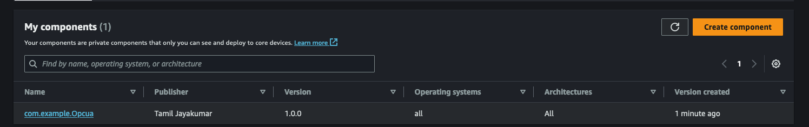

### OPCUA Component Deployment

Noe we can create a deployment package from the AWS management console to deploy some public component necessary for the Core device along with the custom Greengrass component we just published to our AWS Account. Each of these components has their own customizations that can be configured upon deployment especially the Public components. Follow the next set of instructions closely to create a deployment package successfully.

#### Public Components Deployment

We will first deploy three [AWS public components](https://docs.aws.amazon.com/greengrass/v2/developerguide/public-components.html) which is [Greengrass CLI](https://docs.aws.amazon.com/greengrass/v2/developerguide/greengrass-cli-component.html), the [Greengrass nucleus](https://docs.aws.amazon.com/greengrass/v2/developerguide/greengrass-nucleus-component.html) & the [Shadow Manager](https://docs.aws.amazon.com/greengrass/v2/developerguide/shadow-manager-component.html) components.

From the management console, under AWS IoT Core -> Greengrass Devices -> Deployments -> Create Deployment

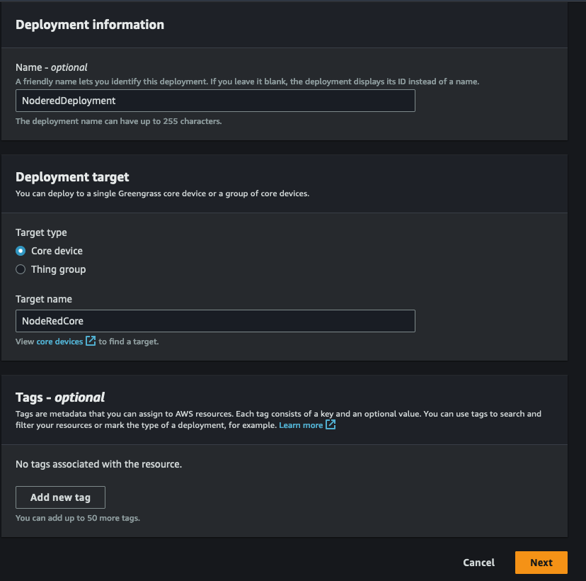

Let's choose only the Public Components first & validate deployments. In the next screen select the aws.greengrass.Cli & aws.greengrass.Nucleus component.

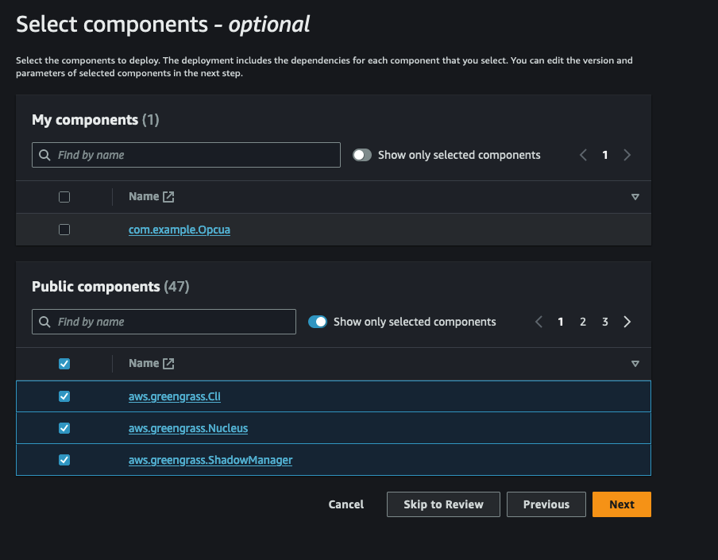

Now comes the [configuration](https://docs.aws.amazon.com/greengrass/v2/developerguide/greengrass-nucleus-component.html#greengrass-nucleus-component-configuration) of the Nucleus component. We need to set the `interpolateComponentConfiguration` flag to `true` Greengrass service will expose the `thingname` as an environment variable to be used in our private/custom components. This is a handy feature and nits highly recommend to enable this.

In the `Configure components - optional` page, select the radio button for  `aws.greengrass.Nucleus` component & click the `Configure Component` button. In the next page enter the following JSON data under the `Configuration to merge` to merge. leave all the rest of the configuration as is and hit `confirm`

```json
{
 "interpolateComponentConfiguration": true
}
```

Similarly we need to [configure](https://docs.aws.amazon.com/greengrass/v2/developerguide/shadow-manager-component.html) the `aws.greengrass.ShadowManager` component to allow access for our custom components to access the Core Device's named shadow `opc`. Here is the `configuration to merge`.

```json
{
 "strategy": {
  "type": "realTime"
 },
 "synchronize": {
  "shadowDocumentsMap": {
   "NodeRedCore": {
    "classic": false,
    "namedShadows": [
     "opc"
    ]
   }
  },
  "direction": "betweenDeviceAndCloud"
 },
 "rateLimits": {
  "maxOutboundSyncUpdatesPerSecond": 100,
  "maxTotalLocalRequestsRate": 200,
  "maxLocalRequestsPerSecondPerThing": 20
 },
 "shadowDocumentSizeLimitBytes": 8192
}

```

Head all the way to review & hit deploy. This deployment can be tracked by tailing the log file under `C:\greengrass\v2\logs\greengrass` file. This will setup the [Greengrass CLI component](https://docs.aws.amazon.com/greengrass/v2/developerguide/gg-cli-reference.html) which is very essential to restart & list all installed components on the Greengrass Core device (a.k.a the EC2 instance in our case).

The Greengrass cli is installed in `C:\greengrass\v2\bin` and can be accessed in the EC2 instance by opening a new terminal window as shown

```cmd
# list all installed components 

cd C:\greengrass\v2\bin 
greengrass-cli component list

# response is 
C:\greengrass\v2\bin> greengrass-cli component list
Components currently running in Greengrass:
Component Name: DeploymentService
    Version: 0.0.0
    State: RUNNING
    Configuration: null
Component Name: aws.greengrass.Nucleus
    Version: 2.12.1
    State: FINISHED
    Configuration:  XXXXXXXXXXXXXXXXXXXXXXX
Component Name: TelemetryAgent
    Version: 0.0.0
    State: RUNNING
    Configuration: null
Component Name: aws.greengrass.ShadowManager
    Version: 2.3.5
    State: RUNNING
    Configuration: {"rateLimits":{"maxLocalRequestsPerSecondPerThing":20.0,"maxOutboundSyncUpdatesPerSecond":100.0,"maxTotalLocalRequestsRate":200.0},"shadowDocumentSizeLimitBytes":8192.0,"strategy":{"type":"realTime"},"synchronize":{"direction":"betweenDeviceAndCloud","shadowDocumentsMap":{"NodeRedCore":{"classic":false,"namedShadows":["opc"]}}}}
Component Name: aws.greengrass.Cli
    Version: 2.12.1
    State: RUNNING
    Configuration: {"AuthorizedPosixGroups":null,"AuthorizedWindowsGroups":null}
Component Name: FleetStatusService
    Version: null
    State: RUNNING
    Configuration: null
Component Name: UpdateSystemPolicyService
    Version: 0.0.0
    State: RUNNING
    Configuration: null
```

#### OPCUA Custom Component Deployment

Now that we have created a deployment for our `NodeRedCore` AWS IoT thing, We can simply revise an existing deployment to include the custom OPCUA connector component. Under the AWS IOt Core management console page, select the deployments and choose `NoderedDeployment`

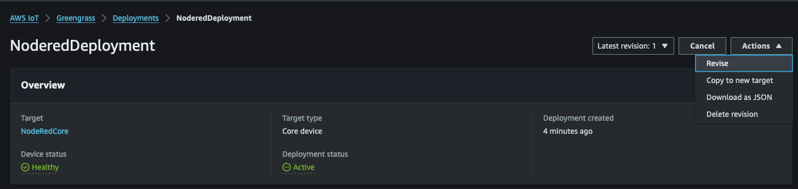

In the `Select components - optional` page, select the OPCUA component under `My components` section

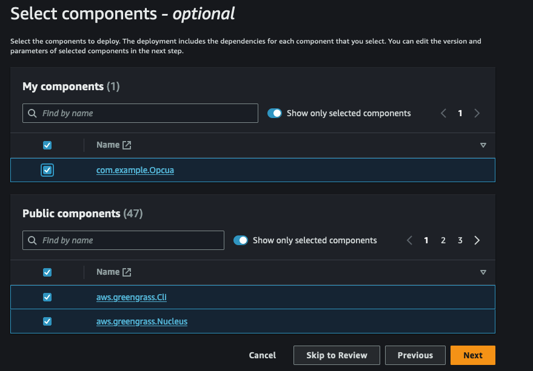

There is no component configuration required as we have already setup the component to have permissions to access the Thing Shadow titled `opc` and listen for shadow events. So simply head to the review section & click deploy.

The component logs can be found under `C:\greengrass\v2\logs\com.example.opcua`.

#### OPCUA Data Synchronizations

Now if you head to the AWS management console & AWS IoT Core -> All Devices -> Things -> NodeRedCore -> Device Shadows -> opc

You can now observe the OPCUA data show up -

```json
{
  "state": {
    "desired": {
      "welcome": "aws-iot"
    },
    "reported": {
      "welcome": "aws-iot",
      "opcua": {
        "TurbineSpeed": 0,
        "TurbineStatus": false
      }
    }
  }
}
```

The custom OPCUA component is now able to listen for node data changes in the OPCUA server & updates the shadow. You can observe that the `TurbineStatus` to `false`, to set the value to `true`, simply edit the shadow from the AWS management console page.

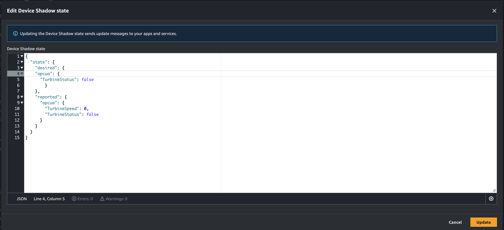

> setting a `null` value to a shadow item key will remove the key from the shadow document

```json
{
  "state": {
    "desired": {
      "opcua": {
         "TurbineStatus": true
      }
    },
    "reported": {
      "opcua": {
        "TurbineSpeed": 0,
        "TurbineStatus": false
      }
    }
  }
}
```

This will set the OPCUA `TurbineStatus` to `true` & random `TurbineSpeed` data will flow in. You may also observe the `TurbineSpeed` data in the RDP UI on the CMD prompt that runs the `node-red` process.  

The response will now resemble the following data

```json
{
  "state": {
    "desired": {
      "opcua": {
        "TurbineStatus": true
      }
    },
    "reported": {
      "opcua": {
        "TurbineSpeed": 777,
        "TurbineStatus": true
      }
    }
  }
}
```

#### OPCUA Component Restart

If the OPCUA component malfunctions the component can be restarted in two ways.

1. revise an existing deployment & deploy without adding/removing any components. This will restart all custom components
2. use GDK CLI on Ec2 instance to perform a component restart, [refer this guide](https://docs.aws.amazon.com/greengrass/v2/developerguide/gg-cli-component.html#component-restart) for instructions

---

## OPCDA Server Setup

Since OPCDA technology is dated, some of the server setup process is tricky & MUST be followed exactly as prescribed. We do not guarantee the outcome if you decide to use any other versions or setup procedure other than the ones prescribed below.

The following setup is in the EC2 instance via RDP through AWS Fleet Manager from AWS management console.

### Python 32 bit Setup

> Please install Python version 3.7 for the OPCDA Matrikon application to work properly

We use Python 3.7 32 bit for OPCDA as the older OPCDA technology works with 32 bit python versions only.

Ensure Python 3 is installed **for all users** as the AWS Greengrass service uses a dedicated user account named `ggc_user`. The option to install python for all users  will ONLY be installed if you choose to Customize Installation; if not the installation will default to Administrator which the Greengrass user will be unable to find and will create runtime errors.

Get the python 3.7 32 bit from the link below -

<https://www.python.org/downloads/release/python-377/>

Ensure to select the following options  in the setup page

- install launcher for all users
- add Python 3.7 to path  
- customize installation

> ensure to follow the selections exactly as shown

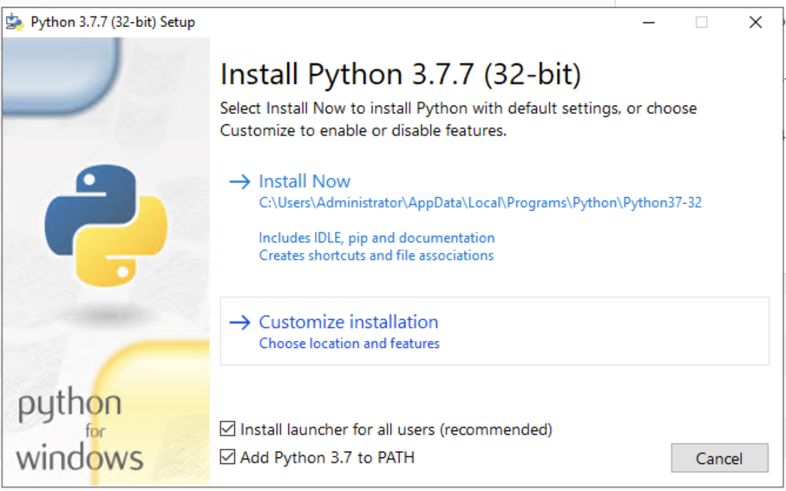
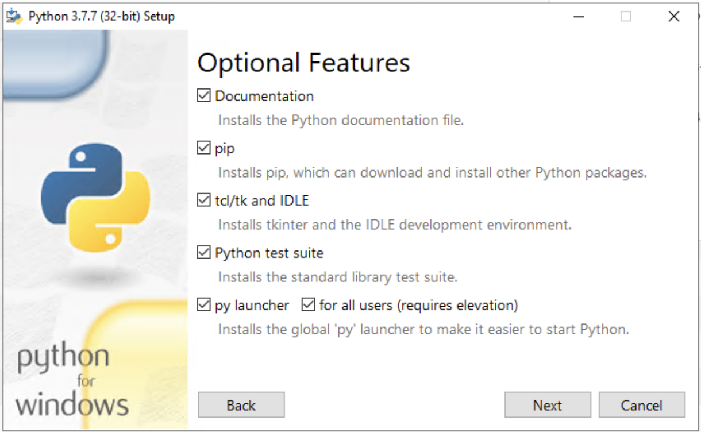
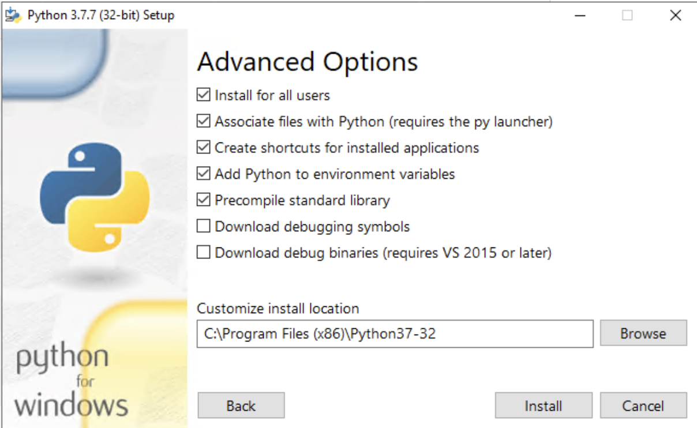

Verify Python installation by opening a new CMD terminal in the EC2 instance

```cmd
C:\Users\Administrator>python --version
Python 3.7.7

```

### Enable .Net

We require .NET as a pre-requisite to install the Matrikon OPC Simulator server & client software.

Enable .net 2.0 on windows server with command `DISM /Online /Enable-Feature:NetFx3 /All`. read more about enabling feature via CMD [here](https://learn.microsoft.com/en-us/windows-hardware/manufacture/desktop/deploy-net-framework-35-by-using-deployment-image-servicing-and-management--dism?view=windows-11)

### Matrikon OPC Simulation Server Setup

You can get the [Matrikon Explorer Windows application](https://www.matrikonopc.com/downloads/178/productsoftware/index.aspx) after registering your email address.

Ensure to keep all the default options in the setup wizard. Once installation is successful you will see the Matrikon OPC classic server is up & running -

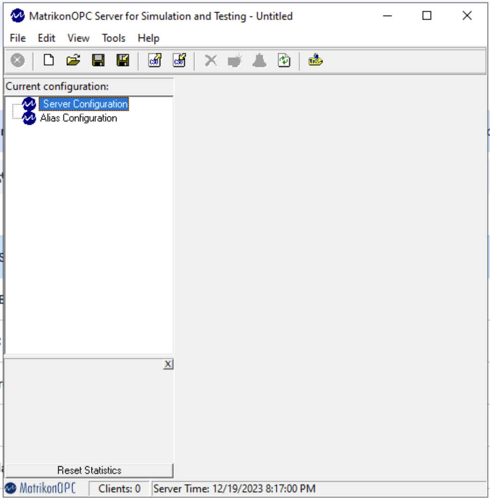

### OPCDA Server Config

The Server[Config is saved as an `xml` in /infra/components/matrikon-opcda-server/opcda_server_config.xml](/infra/components/matrikon-opcda-server/opcda_server_config.xml) and can be loaded to the Server to setup all the tags needed to run this sample. You can also create your own custom tags in the simulation server as well.

In the server windows click on the open folder icon & browse the `/infra/components/matrikon-opcda-server/opcda_server_config.xml` and hit load.

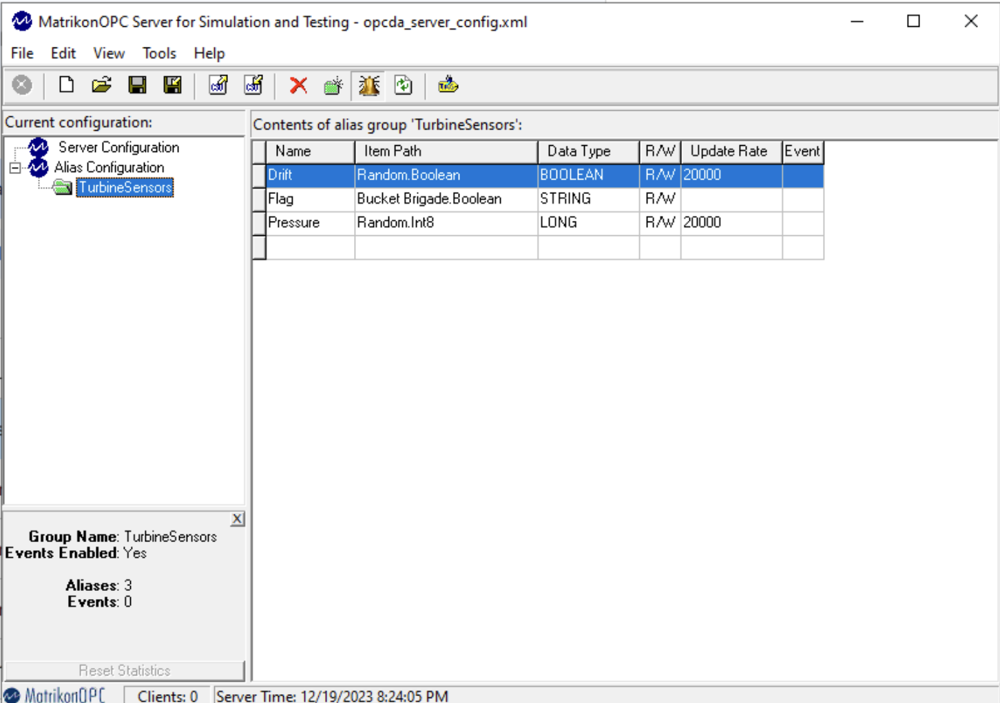

### OPCDA Server Explorer

To explore the data via Matrikon's own Client UI, simply click on the yellow TAG icon on the extreme right end of the tools panel

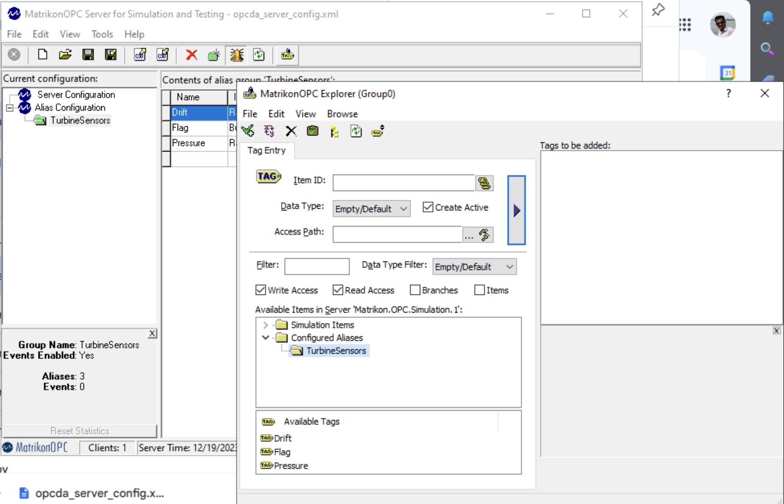

Then select the `Drift`, `Flag` & `Pressure` tags press on the `>` icon to add them to the viewer. Then click on the green `tick` mark icon 9the first icon) in the tools panel. This will open the explorer window with all the selected tags.

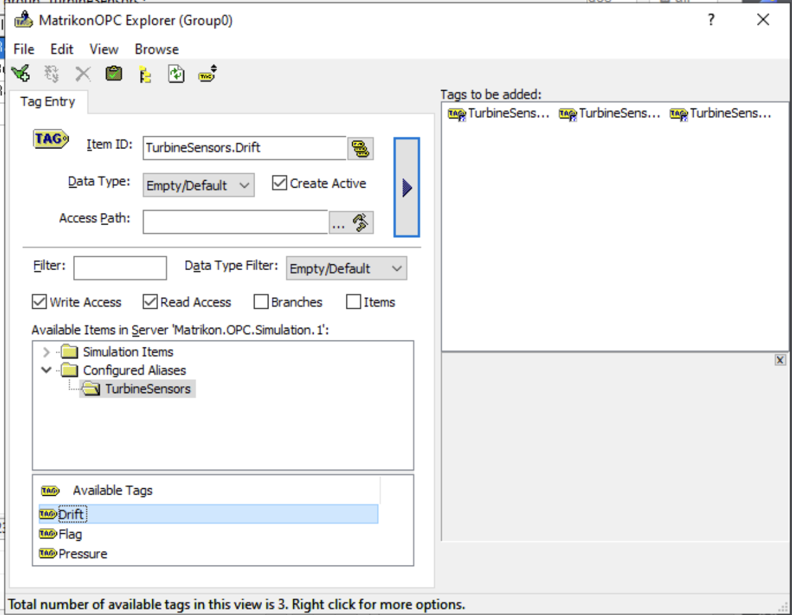

After a few seconds random values start to appear for `TurbineSensors.Drift` & `TurbineSensors.Pressure` simulating Turbine sensor values.

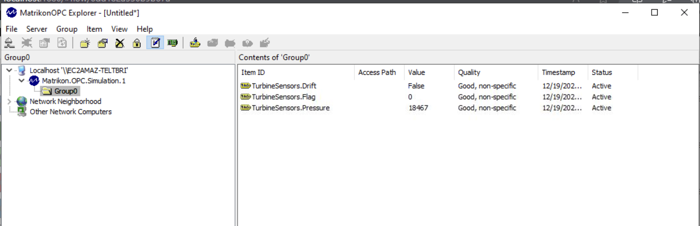

The `TurbineSensors.Flag` tag is a input tag that can be toggled via the Matrikon explorer itself. Simply double click and toggle the value to any number.

### OPCDA Client Configuration

Now that we have a OPCDA server & UI client configured we need to setup the python libraries needed for our OPCDA component to programmatically explore, read & write the OPCDA tag values and sync it to AWS Cloud.

Let's start by setting the OPDA connector libraries. Please note since OPCDA is a dated communication protocol, it uses 32bit software. Even though our Windows Server edition is X64, installation of the x86 versions of the software causes no issues.

Open a new CMD terminal as an `Administrator` and use `pip` to install the following libraries

> Ensure the CMD terminal is opened as an Administrator

```cmd
# aws iot sdk 
pip install awsiotsdk

# opcda python client
pip install OpenOPC-Python3x

# install pywin32
python -m pip install --upgrade pywin32
```

Now copy the [`pywin32_postinstall.py` in /infra/components/matrikon-opcda-server/pywin32_postinstall.py](/infra/components/matrikon-opcda-server/pywin32_postinstall.py) python script to the EC2 instance and run it by the following command

> Ensure the CMD terminal is opened as an Administrator

```cmd
python pywin32_postinstall.py -install

#response 

Parsed arguments are: Namespace(destination='C:\\Program Files (x86)\\Python37-32\\Lib\\site-packages', install=True, quiet=False, remove=False, silent=False, wait=None)
Copied pythoncom37.dll to C:\Windows\SysWOW64\pythoncom37.dll
Copied pywintypes37.dll to C:\Windows\SysWOW64\pywintypes37.dll
Registered: Python.Interpreter
Registered: Python.Dictionary
Registered: Python
-> Software\Python\PythonCore\3.7-32\Help[None]=None
-> Software\Python\PythonCore\3.7-32\Help\Pythonwin Reference[None]='C:\\Program Files (x86)\\Python37-32\\Lib\\site-packages\\PyWin32.chm'
Registered help file
Pythonwin has been registered in context menu
Creating directory C:\Program Files (x86)\Python37-32\Lib\site-packages\win32com\gen_py
Shortcut for Pythonwin created
Shortcut to documentation created
The pywin32 extensions were successfully installed.
```

Now install [GrayboxOpcDa wrapper software](http://gray-box.net/daawrapper.php?lang=en). The fundamental design goal is that this interface is intended to work as a 'wrapper' for existing OPC Data Access Custom Interface Servers providing an automation friendly mechanism to the functionality provided by the custom interface.ds

[Download GrayBoxOPCDA from here](http://gray-box.net/download_daawrapper.php?lang=en)

> Ensure the CMD terminal is opened as an Administrator

```cmd
cd C:\Users\Administrator\Downloads\graybox_opc_automation_wrapper\x64
regsvr32 gbda_aut.dll 

# To remove Graybox OPC DA Auto Wrapper from your system registry enter 
regsvr32 gbda_aut.dll -u.
```

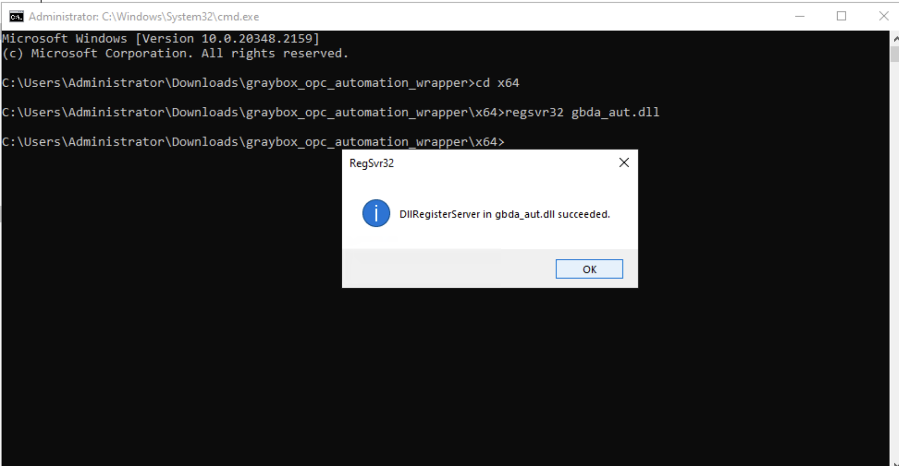

---

## OPCDA Custom Component Deployment

The [OPCDA component in /infra/components/opcda/](/infra/components/opcda/) is written in python using the same AWS Greengrass Development kit like the OPCUA component. Lets now build & publish the OPCDA component to the target AWS Account exactly like how we published our OPCUA component.

### Build & Publish OPCDA Component

In your developer machine cd into the `/infra/components/opcda/` folder and enter the following commands

Let's verify the gdk-config file in `/infra/components/opcda/gdk-config.json` and make sure we have the right region selected. Note, this region must be same as the region where the CDK deployment was made & where the Greengrass Core device was registered.

Now in a terminal window `cd` into the /opcda folder

```cmd
cd /infra/components/opcda/

  opcda git:(mainline) ✗ gdk component build
[2023-12-19 12:59:32] INFO - New version of GDK CLI - 1.6.1 is available. Please update the cli using the command `pip3 install git+https://github.com/aws-greengrass/aws-greengrass-gdk-cli.git@v1.6.1`.

[2023-12-19 12:59:32] INFO - Building the component 'com.example.Opcda' with the given project configuration.
[2023-12-19 12:59:32] INFO - Using 'zip' build system to build the component.
[2023-12-19 12:59:32] WARNING - This component is identified as using 'zip' build system. If this is incorrect, please exit and specify custom build command in the 'gdk-config.json'.
[2023-12-19 12:59:32] INFO - Validating the file size of recipe /opcua-da/code/full-duplex-opc-ua-da-unifier-for-industrial-iot/infra/components/opcda/recipe.yaml
[2023-12-19 12:59:33] INFO - Copying over the build artifacts to the greengrass component artifacts build folder.
[2023-12-19 12:59:33] INFO - Updating artifact URIs in the recipe.
[2023-12-19 12:59:33] INFO - Validating the recipe against the Greengrass recipe schema.

```

Let's now publish the OPCDA component

```cmd
# publish the component 
gdk component publish

#response 

...
...
...
[2023-12-19 13:00:56] INFO - Not creating an artifacts bucket as it already exists.
[2023-12-19 13:00:57] INFO - Updating the component recipe com.example.Opcda-1.0.0.
[2023-12-19 13:00:57] INFO - Validating the file size of the built recipe  /opcua-da/code/full-duplex-opc-ua-da-unifier-for-industrial-iot/infra/components/opcda/greengrass-build/recipes/com.example.Opcda-1.0.0.yaml
[2023-12-19 13:00:57] INFO - Validating the built recipe against the Greengrass recipe schema.
[2023-12-19 13:00:57] INFO - Creating a new greengrass component com.example.Opcda-1.0.0.
[2023-12-19 13:00:57] INFO - Created private version '1.0.0' of the component 'com.example.Opcda' in the account.
```

## Deployment Validation

You can verify the components deployment status from AWS IoT Core Service page and heading to Greengrass devices  -> Components and verify if the list contains `com.example.Opcua` &
`com.example.Opcda` under the `My Components` tab.

The Public Component list can be found under the `Public Components` tab. Please note this list is the complete list of **all** public components & not just the ones we need for this project.

## Running the Guidance

### Revise existing Deployment

Let's re-se the existing deployment we created named `NoderedDeployment` and select the OPCDA component `com.example.Opcda`

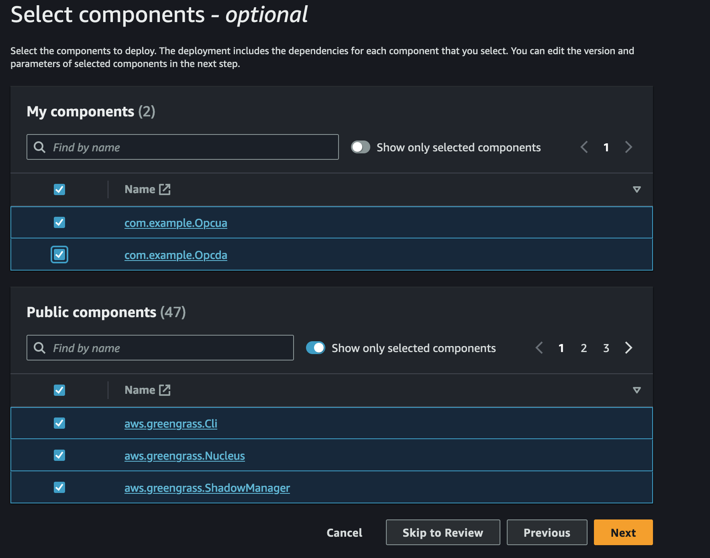

Once the deployment succeeds, you can see a new section `opcda` added to our `opc` shadow under our AWS Greengrass Core device `NodeRedCore`

```json
{
  "state": {
    "desired": {
      "opcua": {
        "TurbineStatus": false
      }
    },
    "reported": {
      "opcua": {
        "TurbineSpeed": 0,
        "TurbineStatus": false
      },
      "opcda": [
        {
          "name": "TurbineSensors.Flag",
          "value": "False",
          "status": "Good"
        },
        {
          "name": "TurbineSensors.Drift",
          "value": false,
          "status": "Good"
        },
        {
          "name": "TurbineSensors.Pressure",
          "value": 11611,
          "status": "Good"
        }
      ]
    }
  }
}

```

### OPCDA Data Synchronizations

Now to toggle the tag `TurbineSensors.Flag` edit the shadow as shown below

```json
{
  "state": {
    "desired": {
      "opcua": {
        "TurbineStatus": false # you may change this as well
      },
      "opcda":{
          "flag": 1234
      }
    },
    ...
    ...
    ...

```

One the shadow is updated the Matrikon explorer will reflect the value set by the Shadow document

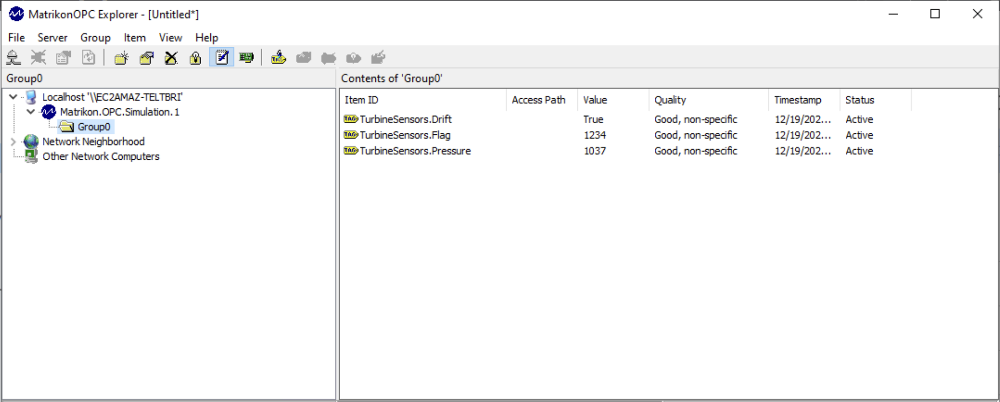

#### OPCDA Component Restart

If the OPCDA component malfunctions the component can be restarted in two ways.

1. revise an existing deployment & deploy without adding/removing any components. This will restart all custom components
2. use GDK CLI on Ec2 instance to perform a component restart, [refer this guide](https://docs.aws.amazon.com/greengrass/v2/developerguide/gg-cli-component.html#component-restart) for instructions

---

## Conclusion

Congratulations, you have now successfully created a OPCUA/DA protocol unifier/convertor using AWS IOT Greengrass.

Play around with the components and add new components to the deployment to unify many other IIOT communication protocols such as Modbus, serial etc.

---

## Next Steps

1. Build & deploy a custom component to convert other standard IoT protocols such as Modbus via the [node-red-contrib-modbus](https://flows.nodered.org/node/node-red-contrib-modbus) package.
2. Introduce other shadow variables to allow data to be exchanged between the two custom components via the [MQTT Bridge](https://docs.aws.amazon.com/greengrass/v2/developerguide/mqtt-bridge-component.html) component.
3. Deploy the [IoT SiteWise OPC-UA data source simulator](https://docs.aws.amazon.com/greengrass/v2/developerguide/iotsitewise-opcua-data-source-simulator-component.html) public component to act as the IoT SiteWise OPC-UA data source simulator component. This starts a local OPC-UA server that generates sample data that can be read by the opcua custom component.
4. Deploy the [IoT SiteWise OPC-UA collector](https://docs.aws.amazon.com/greengrass/v2/developerguide/iotsitewise-opcua-collector-component.html) component that enables AWS IoT SiteWise gateways to collect data from local OPC-UA servers such as NodeRED.
5. Deploy the [IoT SiteWise publisher component](https://docs.aws.amazon.com/greengrass/v2/developerguide/iotsitewise-publisher-component.html) that enables AWS IoT SiteWise gateways to export data from the edge to the AWS Cloud.
6. To save cost, remember to shut down the EC2 instance when not in use.

---

## Clean up

Run the following command to destroy the CDK application and all infrastructure components which destroys the EC2 instance which acts as the AWS IoT Core Greengrass Core device, EC2 related resources such as VPC, Security Groups etc, along with the AWS S3 Greengrass components bucket & the AWS IAM roles and permissions necessary to provide access to AWS services to talk to one another.

```unix
cdk destroy --all
```

Please note the custom components stored in the AWS S3 buckets will not be auto deleted by destroying the CDK stacks and must be deleted manually. Similarly, the components deployments must be manually `cancelled` manually to stop from AWS Iot Core service page -> Greengrass devices -> Deployments -> NoderedDeployment and click `Revise`.

---

## Notices

See [CONTRIBUTING]('./CONTRIBUTING.md) for more information. This library is licensed under the MIT-0 License. See the [LICENSE]('./LICENSE) file.
